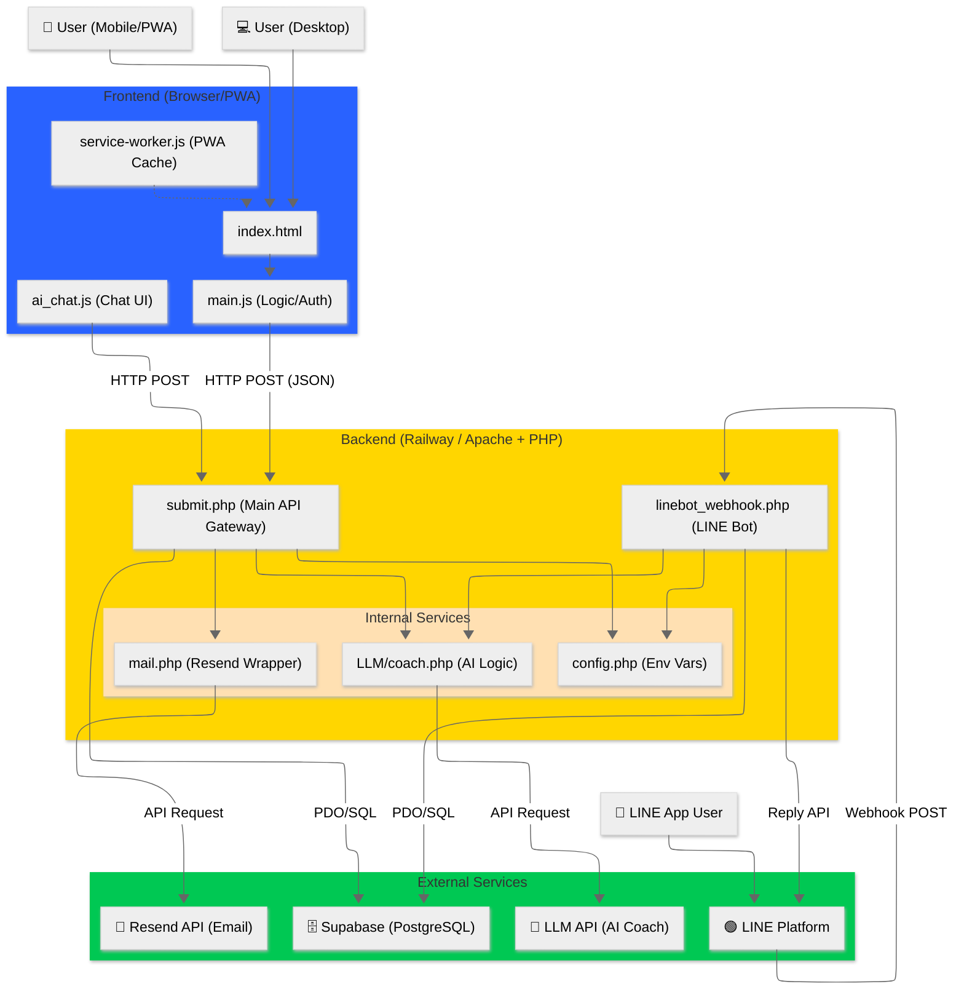
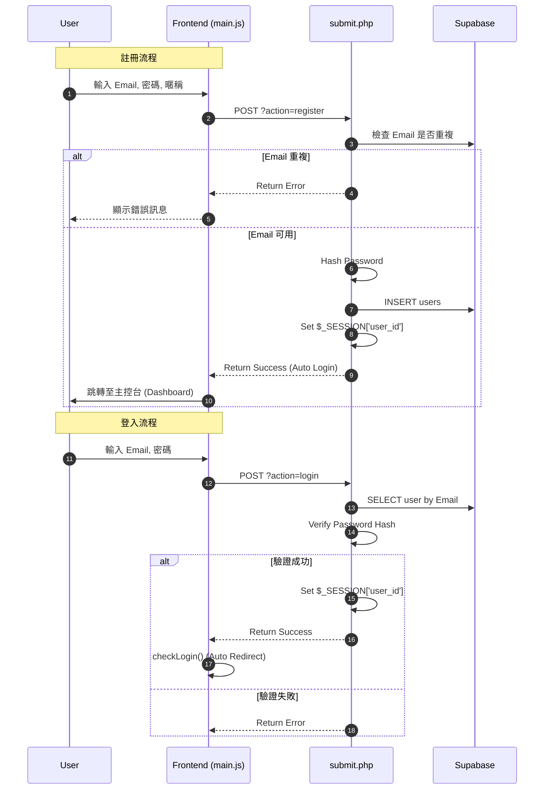
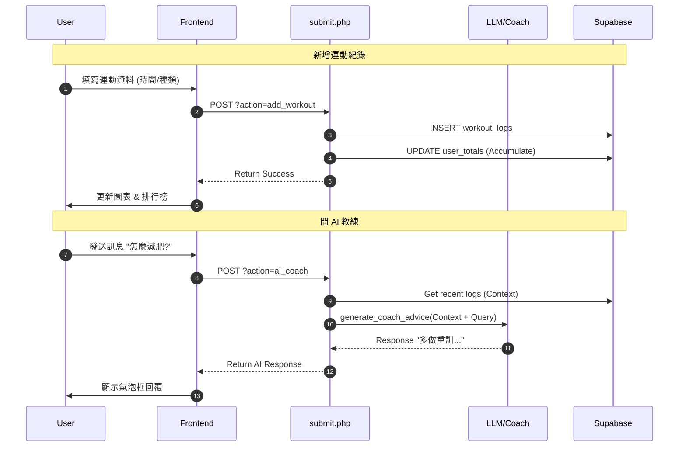
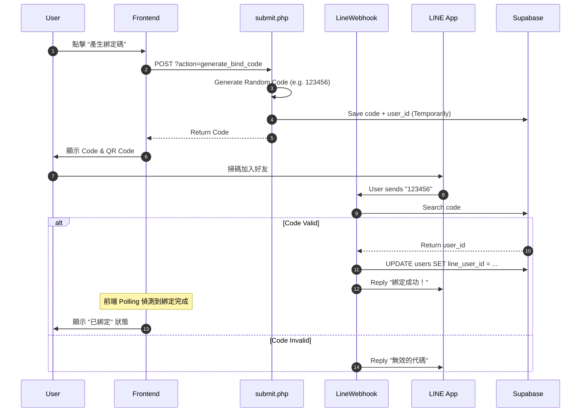
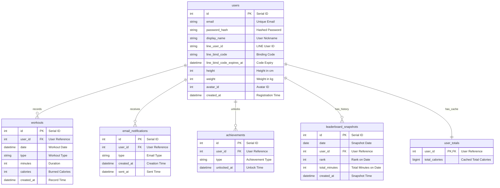

# FitConnect (WTF text) 系統架構文檔

## 1. 系統架構圖 (System Architecture)

本專案採用前後端分離的概念，但部署於單一 Railway 服務（PHP/Apache）。

---

## 2. 核心流程圖 (Core Processes)

### 2.1 登入與註冊流程 (Auth Flow)

### 2.2 運動紀錄與 AI 教練流程 (Workout & AI)

### 2.3 LINE 綁定流程 (LINE Binding)

---

## 3. 資料庫實體關係圖 (Database ER Diagram)

